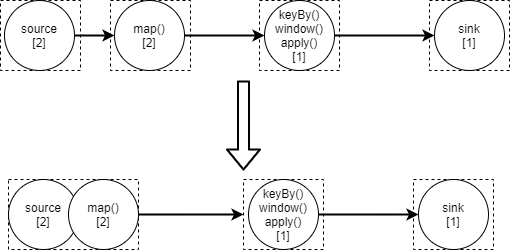

> 本文档是基于Flink-1.14.4所写，非该版本内容会特别说明


# 流处理API

## 算子


### 算子概念


### Source算子

#### KafkaSource算子


```java
KafkaSource<String> kafkaSource = KafkaSource.<String>builder()
                .setTopics("test")
                .setGroupId("test")
                .setBootstrapServers("test")
                // 设置 kafka 偏移量
                .setStartingOffsets(OffsetsInitializer.committedOffsets(OffsetResetStrategy.LATEST)) // 消费起始位移选择之前所提交的偏移量（如果没有，则重置为 LATEST）
                //.setStartingOffsets(OffsetsInitializer.earliest()) // 消费起始位移为 “最早”
                //.setStartingOffsets(OffsetsInitializer.latest()) // 消费起始位移为 “最新”
                //.setStartingOffsets(OffsetsInitializer.offsets(Map< TopicPartition, Long>)) // 消费起始位置为：方法传入的每个分区及对应的起始偏移量
                // 设置 kafka 消息反序列化器
                .setValueOnlyDeserializer(new SimpleStringSchema()) // 设置反序列化器，kafka 消息中只有 value 值
                //.setDeserializer(KafkaRecordDeserializationSchema) // 设置反序列化器，kafka 消息中既有 key 值，也有 value 值
                // 把 source 算子设置成 BOUNDED 属性（即有界流），就是读到传入参数指定的位置就停止读取并退出。
                // 常用于补数或者重跑某一段历史数据
                .setBounded(OffsetsInitializer.committedOffsets())
                // 把 source 算子设置成 UNBOUNDED 属性（即无界流），但是并不会一直读数据，而是到达参数指定位置后就停止读取，但程序不退出。
                // 主要应用场景：需要从 kafka 中读取某一段固定长度的数据，然后拿着这段数据去跟另外一个真正的无界流联合处理
                .setUnbounded(OffsetsInitializer.committedOffsets())
                // 设置 kafka 的其他属性
                //.setProperties()
                // 开启 kafka 底层消费者的自动偏移量提交机制，它会把最新的消费偏移提交到 kafka 的 consumer_offsets 中。
                // 就算开启了自动偏移里昂提交机制，KafkaSource 依然不依靠自动偏移量提交机制（宕机重启时，优先从 flink 自己的状态中获取 topic 的偏移量，因为更可靠；
                // 状态中没有的话才从 kafka 的 consumer_offsets 中拿）
                .setProperty(ConsumerConfig.ENABLE_AUTO_COMMIT_CONFIG, "true")
                .build();
```


#### 自定义Source算子


### Transformation算子

#### map算子


#### flatMap算子


#### project算子


类似 sql 中的 select


### Sink算子


#### StreamFileSink


#### KafkaSink


#### JdbcSink


#### RedisSink


### 分区算子

​	涉及到分布式存储概念的系统或者框架中常有分区概念，例如kafka、es等。它们常常把数据切割分为不同的部分存储到集群中的不同节点机器上，这样的好处显而易见：不会受单台机器存储能力的限制，利用分布式集群的水平扩展能力支持海量数据的存储。

​	flink是一个分布式计算的框架，也存在数据分区概念，但和分布式存储中的分区概念略有不同。flink会将task划分为一个或多个subtask，每个subtask处理一部分数据，从而提升计算处理能力。所以flink中的分区指的是将上游算子产生的数据发送到下游算子的哪一个subtask中。提供这种能力的算子就叫做**分区算子**。

> task和subtask的详细内容会在接下来的部分进行详细介绍


#### 分区策略


one-to-one

redistribution


## 多流转换


#### 连接流（connect）


#### 广播流（broadcast）


#### 合并流（union）


#### 关联操作（join）

类似sql中的join关键字


#### 协同分组（coGroup）


#### 侧输出流（side-ouput）


# Flink架构

## 概述


## 核心概念

​	本章节介绍一些flink应用程序中的核心概念。

[Flink核心概念：job、task、taskslot等]([【深入浅出flink】第3篇：多图讲解flink核心概念（通俗易懂）Job、Task、SubTask、Slot、Slotsharing、Parallelism、Operator Chains_flink job-CSDN博客](https://blog.csdn.net/qq_37555071/article/details/122374146) )


### Job

​	Job可以表示一个独立提交给Flink运行的应用程序。通常Job是通过JobManager提交到Flink中的，所以经由JobManager提交的都是指Job，不过JobManager一次提交的可以包含多个Job。

### 算子（Operator）

​	算子是Flink提供给用户的接口，通过该接口能够对数据流进行处理。通常一个接口称为一个算子，常见算子有：map、filter、flatmap、keyBy等等。


#### 理解 Transformation

[理解Flink之三Transformation - hnrainll - 博客园](https://www.cnblogs.com/hnrainll/p/13025626.html) 

[Flink - Transformations - Ying](https://izualzhy.cn/flink-source-transformations) 

[追源索骥：透过源码看懂Flink核心框架的执行流程-腾讯云开发者社区-腾讯云](https://cloud.tencent.com/developer/article/1172583) 


### 算子链（Operator Chain）

​	算子链顾名思义就是将多个算子链接到一起。因为Flink是分布式流计算引擎，是运行在不同机器上的，算子与算子之间会有数据传递，数据传递过程会有一系列序列化、反序列化和网络IO等耗时操作，Flink为了提升性能，会将可以链接在一起的算子链接一起，这样他们直接的数据就可以在一个线程中传递，不需要经过以上复杂且耗费性能的操作。



disableChain startNewChain


### Task

​	Task是一个逻辑概念，一个Operator就代表一个Task（多个Operator被chain之后产生的新Operator算一个Operator）


### SubTask

​	SubTask是调度的基本单元。SubTask是Flink运行中的Task实例，Task会按照算子的并行度设置具有一个或多个SubTask，每个SubTask实例运行在不同的TaskSlot中。


## JobManager


## TaskManager

​	TaksManager简称TM，是负责真正执行flink任务的jvm进程，一个TM可以执行一个或者多个subtask

### TaskSlot

​	**TaskSlot是资源分配的基本单元。**

​	TaskSlot起到隔离TM中的资源作用，注意：**仅隔离内存资源，不隔离CPU资源**。TM中有一个或多个TaskSlot，TM将自身内存资源均分给TaskSlot，但TaskSlot之间共享CPU资源。例如：一个TM有三个TaskSlot，意味着每个TaskSlot有三分之一TaskManager内存。 

> 尽管slot并不单独分配cpu资源，我们可以通过当前taskmanger的cpu core数量来设置slot数，这样一个slot占用一个cpu core，可以更快的执行。为了更好的性能，一般cpu core数量设置为slot数，或者slot数+1


**槽位共享组（slot sharing group）**

​	为了更高效地使用资源，Flink默认允许同一个Job中不同Task的SubTask运行在同一个Slot中，这就是SlotSharing（子任务共享）。注意以下描述中的几个关键条件：

- 必须是同一个Job。这个很好理解，slot是给Job分配的资源，目的就是隔离各个Job，如果跨Job共享，但隔离就失效了；
- 必须是不同Task的Subtask。这样是为了更好的资源均衡和利用。一个计算流中（pipeline），每个Subtask的资源消耗肯定是不一样的，如果都均分slot，那必然有些资源利用率高，有些低。限制不同Task的Subtask共享可以尽量让资源占用高的和资源占用低的放一起，而不是把多个高的或多个低的放一起。比如一个计算流中，source和sink一般都是IO操作，特别是source，一般都是网络读，相比于中间的计算Operator，资源消耗并不大。相反，如果是同一个Task的Subtask放在一个slot中执行，我们就违背了并行执行的初心，放在一个slot不就是串行执行了。

默认是允许sharing的，可以通过slotSharingGroup给不同算子设置不同的共享组。关闭这个特性，不同共享组的算子一定在两个slot中。


## Flink部署模式

# 核心概念


## 时间语义


事件时间、处理时间、注入时间

​	事件时间指的是该事件发生时的时间，不受时区等外在因素的影响。事件时间一般在数据流中的元素中携带的，所以可以从数据流中的元素提取来的。

## 水位线（Watermark）

​	Flink是流计算引擎，其中数据流是核心概念，相关的分析、统计、聚合、窗口等功能都是基于时间的，但该时间是如何定义和衡量的呢？那么就要用到上文介绍的事件时间。

​	在理想的情况下，无论数据的到达时间如何，使用事件时间都可以产生连续且确定的结果。但现实往往是残酷的，只要在事件是顺序到达Flink的这种情况才会实现这个效果。如下图所示，数据流中的事件是顺序到达Flink引擎的。事件顺序的好处是基于事件时间的后续统计、窗口等处理都可以产生连续且确定的结果，这个特性是非常重要的。

> 这里的**事件顺序到达**是指事件到达Flink引擎是顺序的。
>
> 到达Flink引擎的顺序与否是与事件的产生顺序无关的，如果事件是否是顺序生成还是乱序生成，只要到达Flink引擎的时候是顺序的都可以

​	


​	生产实践中绝大多数会出现下图的情况，事件时间是乱序的，造成乱序的原因是多样的，例如网络波动、消息发到kafka等消息中间件不是顺序的或者消费时导致乱序等等这一系列因素。事件乱序下，使用事件时间来进行统计、窗口等计算时产生的结果是不确定的。考虑这个计算场景：统计10到15秒内的事件个数，以下图为例，11那个元素会被统计到，随后而来的元素15将会触发窗口的计算，那么统计结果是1。从图片中可以明显看到这个结果是不对的，除了11，还有12,14一共三个元素，真正的统计结果应该是3。这里设计到的窗口等概念会在接下来的章节中介绍。


​	从解决上面问题的角度出发，为了获取到完整的统计结果，要观察15后面是否还有小于15且大于等于10的元素，那么如何等待？等待多长时间呢？Flink提出了水位线的机制，水位线的出现就是为了解决这些问题的。如上图所示，在一个乱序的数据流中，随着流中数据前进，Flink会固定时间间隔的在流中插入一个水位线，例如在元素12后面插入了水位线11，表示Flink数据流中目前该当前算子11之前的元素都被处理了。

​	水位线这个概念只有在应用程序使用事件时间时才会存在，当然Flink的默认时间就是事件时间。水位线是用来衡量事件时间进度，它产生于事件时间，在事件时间的基础上实现了更多功能，例如：延迟（lateness）。水位线*`T`*意味着数据流处理到了时*`T`*，即后续到达的数据事件时间不会再大于*`T`*了。但是在大多数情况下，即使水位线到了事件*`T`*后，后序还会持续来比*`T`*小的数据，这样的数据成为迟到数据（late event）。Flink提供了对于迟到数据的多种处理方式，在接下来的章节中会持续的介绍。

-[]  水位线本质上也是一个时间戳

-[] 水位线默认是周期性的产生；也可以自定义水位线的产生时机

-[] 水位线是基于当前流中数据时间戳产生的

-[] 水位线必须是单调递增的，以保证任务是一直向前推进的


> todo: 对水位线的本质理解和特性还缺少很多描述，待补充

​	水位线在Flink中是用`Watermark`这个类表示的，从类定义可以看出，水位线的本质就是时间戳。

- 水位线的初始值为`Long.MIN_VALUE`（即数据流中尚未产生数据时）
- 水位线为`Long.MAX_VALUE`时，表示已经到达了流末尾，该水位线是流中的最后一条数据

```java
public final class Watermark implements Serializable {

    private static final long serialVersionUID = 1L;

    /** Thread local formatter for stringifying the timestamps. */
    private static final ThreadLocal<SimpleDateFormat> TS_FORMATTER =
            ThreadLocal.withInitial(() -> new SimpleDateFormat("yyyy-MM-dd HH:mm:ss.SSS"));

    // ------------------------------------------------------------------------

    /** The watermark that signifies end-of-event-time. */
    public static final Watermark MAX_WATERMARK = new Watermark(Long.MAX_VALUE);

    // ------------------------------------------------------------------------

    /** The timestamp of the watermark in milliseconds. */
    private final long timestamp;

    /** Creates a new watermark with the given timestamp in milliseconds. */
    public Watermark(long timestamp) {
        this.timestamp = timestamp;
    }

    /** Returns the timestamp associated with this Watermark. */
    public long getTimestamp() {
        return timestamp;
    }
    
    // 省略一些其他方法......
}
```


### 水位线生成策略

​	水位线是从事件时间提取的，水位线的生成是有多种策略的。

​	水位线是可以从任何算子开始生成，如果是从source算子生成，整个Flink程序都会有水位线；如果从map算子生成，那么map算子后的所有算子都会有水位线。

​	Flink中的水位线可以分为两大类：内置水位线和自定义水位线。

- 内置水位线
  - 单调递增的水位线
  - 乱序数据流的水位线
- 自定义水位线


​	水位线在Flink中是通过`WatermarkGenerator`这个类来定义的，但该类一般是内部使用或者在自定义水位线的场景中才显示使用。一般情况下通过`WatermarkGenerator`的工厂类`WatermarkStrategy`来生成水位线，这个类也是Flink提供给用户来定义水位线的程序接口。在绝大数情况下使用该接口即可。

```java
DataStream<Event> stream = ...

WatermarkStrategy<Event> strategy = WatermarkStrategy
        .<Event>forBoundedOutOfOrderness(Duration.ofSeconds(20))
        .withTimestampAssigner((event, timestamp) -> event.timestamp);

DataStream<Event> withTimestampsAndWatermarks =
    stream.assignTimestampsAndWatermarks(strategy);
```


```java
public interface WatermarkStrategy<T>
        extends TimestampAssignerSupplier<T>, WatermarkGeneratorSupplier<T> {

    // ------------------------------------------------------------------------
    //  Methods that implementors need to implement.
    // ------------------------------------------------------------------------

    /** Instantiates a WatermarkGenerator that generates watermarks according to this strategy. */
    @Override
    WatermarkGenerator<T> createWatermarkGenerator(WatermarkGeneratorSupplier.Context context);

    /**
     * Instantiates a {@link TimestampAssigner} for assigning timestamps according to this strategy.
     */
    @Override
    default TimestampAssigner<T> createTimestampAssigner(
            TimestampAssignerSupplier.Context context) {
        // By default, this is {@link RecordTimestampAssigner},
        // for cases where records come out of a source with valid timestamps, for example from
        // Kafka.
        return new RecordTimestampAssigner<>();
    }

    // ------------------------------------------------------------------------
    //  Builder methods for enriching a base WatermarkStrategy
    // ------------------------------------------------------------------------

    /**
     * Creates a new {@code WatermarkStrategy} that wraps this strategy but instead uses the given
     * {@link TimestampAssigner} (via a {@link TimestampAssignerSupplier}).
     *
     * <p>You can use this when a {@link TimestampAssigner} needs additional context, for example
     * access to the metrics system.
     *
     * <pre>
     * {@code WatermarkStrategy<Object> wmStrategy = WatermarkStrategy
     *   .forMonotonousTimestamps()
     *   .withTimestampAssigner((ctx) -> new MetricsReportingAssigner(ctx));
     * }</pre>
     */
    default WatermarkStrategy<T> withTimestampAssigner(
            TimestampAssignerSupplier<T> timestampAssigner) {
        checkNotNull(timestampAssigner, "timestampAssigner");
        return new WatermarkStrategyWithTimestampAssigner<>(this, timestampAssigner);
    }

    /**
     * Creates a new {@code WatermarkStrategy} that wraps this strategy but instead uses the given
     * {@link SerializableTimestampAssigner}.
     *
     * <p>You can use this in case you want to specify a {@link TimestampAssigner} via a lambda
     * function.
     *
     * <pre>
     * {@code WatermarkStrategy<CustomObject> wmStrategy = WatermarkStrategy
     *   .<CustomObject>forMonotonousTimestamps()
     *   .withTimestampAssigner((event, timestamp) -> event.getTimestamp());
     * }</pre>
     */
    default WatermarkStrategy<T> withTimestampAssigner(
            SerializableTimestampAssigner<T> timestampAssigner) {
        checkNotNull(timestampAssigner, "timestampAssigner");
        return new WatermarkStrategyWithTimestampAssigner<>(
                this, TimestampAssignerSupplier.of(timestampAssigner));
    }

    /**
     * Creates a new enriched {@link WatermarkStrategy} that also does idleness detection in the
     * created {@link WatermarkGenerator}.
     *
     * <p>Add an idle timeout to the watermark strategy. If no records flow in a partition of a
     * stream for that amount of time, then that partition is considered "idle" and will not hold
     * back the progress of watermarks in downstream operators.
     *
     * <p>Idleness can be important if some partitions have little data and might not have events
     * during some periods. Without idleness, these streams can stall the overall event time
     * progress of the application.
     */
    default WatermarkStrategy<T> withIdleness(Duration idleTimeout) {
        checkNotNull(idleTimeout, "idleTimeout");
        checkArgument(
                !(idleTimeout.isZero() || idleTimeout.isNegative()),
                "idleTimeout must be greater than zero");
        return new WatermarkStrategyWithIdleness<>(this, idleTimeout);
    }
    
    // 省略一些其他方法......
}
```


下面看下产生水位线的类：`WatermarkGenerator`


```java
public interface WatermarkGenerator<T> {

    /**
     * Called for every event, allows the watermark generator to examine and remember the event
     * timestamps, or to emit a watermark based on the event itself.
     */
    void onEvent(T event, long eventTimestamp, WatermarkOutput output);

    /**
     * Called periodically, and might emit a new watermark, or not.
     *
     * <p>The interval in which this method is called and Watermarks are generated depends on {@link
     * ExecutionConfig#getAutoWatermarkInterval()}.
     */
    void onPeriodicEmit(WatermarkOutput output);
}
```


**乱序水位线（Bounded out of orderness Watermark）**


```java
public class BoundedOutOfOrdernessWatermarks<T> implements WatermarkGenerator<T> {

    /** The maximum timestamp encountered so far. */
    private long maxTimestamp;

    /** The maximum out-of-orderness that this watermark generator assumes. */
    private final long outOfOrdernessMillis;

    /**
     * Creates a new watermark generator with the given out-of-orderness bound.
     *
     * @param maxOutOfOrderness The bound for the out-of-orderness of the event timestamps.
     */
    public BoundedOutOfOrdernessWatermarks(Duration maxOutOfOrderness) {
        checkNotNull(maxOutOfOrderness, "maxOutOfOrderness");
        checkArgument(!maxOutOfOrderness.isNegative(), "maxOutOfOrderness cannot be negative");

        this.outOfOrdernessMillis = maxOutOfOrderness.toMillis();

        // start so that our lowest watermark would be Long.MIN_VALUE.
        this.maxTimestamp = Long.MIN_VALUE + outOfOrdernessMillis + 1;
    }

    // ------------------------------------------------------------------------

    @Override
    public void onEvent(T event, long eventTimestamp, WatermarkOutput output) {
        maxTimestamp = Math.max(maxTimestamp, eventTimestamp);
    }

    @Override
    public void onPeriodicEmit(WatermarkOutput output) {
        output.emitWatermark(new Watermark(maxTimestamp - outOfOrdernessMillis - 1));
    }
}
```


### 水位线传播


水位线可以在任意非sink算子中设置，当水位线被设置后，后续的算子都具有水位线的功能。


## 窗口（Window）

​	窗口是Flink中的一个核心概念，窗口将一个“无限的数据流”切分成一个个“有限的小的数据流”，在“有限的小的数据流”可以进行统计、聚合等计算。这样可以实现在一个“无限的数据流”上面按照时间段进行统计等业务计算。


窗口的两种应用场景

**Keyed Windows**

```java
stream
       .keyBy(...)               <-  keyed versus non-keyed windows
       .window(...)              <-  required: "assigner"
      [.trigger(...)]            <-  optional: "trigger" (else default trigger)
      [.evictor(...)]            <-  optional: "evictor" (else no evictor)
      [.allowedLateness(...)]    <-  optional: "lateness" (else zero)
      [.sideOutputLateData(...)] <-  optional: "output tag" (else no side output for late data)
       .reduce/aggregate/apply()      <-  required: "function"
      [.getSideOutput(...)]      <-  optional: "output tag"
```


**Non-Keyed Windows**

```java
stream
       .windowAll(...)           <-  required: "assigner"
      [.trigger(...)]            <-  optional: "trigger" (else default trigger)
      [.evictor(...)]            <-  optional: "evictor" (else no evictor)
      [.allowedLateness(...)]    <-  optional: "lateness" (else zero)
      [.sideOutputLateData(...)] <-  optional: "output tag" (else no side output for late data)
       .reduce/aggregate/apply()      <-  required: "function"
      [.getSideOutput(...)]      <-  optional: "output tag"
```


### 窗口类别

​	flink按照功能的不同提供了丰富的窗口种类，

- [ ] 时间窗口（time window）
  - 滑动时间窗口（tumbling time window）
  - 滚动时间窗口（sliding time window）
- [ ] 计数窗口（count window）
- [ ] 会话窗口（session window）
- [ ] 全局窗口（all window）

其中时间窗口又可以细分为事件时间窗口和处理时间窗口。


​	窗口的创建是由窗口分配器（window assigner）负责的，窗口分配器将属于该数据流中元素的0个或多个窗口分配给该元素。


#### 窗口生命周期

​	窗口会在第一个分配进入该窗口时创建，窗口是在时间超过（窗口结束时间 + 设置的“允许迟到时间”）后被销毁。


#### **时间窗口的时间计算**

Flink程序运行起来，第一个窗口的起始时间是多少？有啥规律？


### 触发器（Trigger）

​	窗口何时结束是由窗口触发器决定的，即决定窗口计算的时机。定义窗口时，会有个默认触发器，也可以显示的指定窗口触发器，显示指定的触发器将会覆盖默认触发器。


### 驱逐器（Evictor）


### 窗口处理算子

​	窗口处理算子是在窗口被触发器触发后进行计算的。有四种窗口处理算子：

- [ ] `ReduceFunction`
- [ ] `AggregateFunction`
- [ ] `ProcessWindowFunction`
- [ ] `WindowFunction`


### 允许迟到数据（Allowed Lateness）


# Process Function

# 状态管理


​	Flink在其官网上就宣称是一个有状态计算的分布式流数据处理引擎。本章节将从以下几个角度来介绍Flink中的状态管理。

- 什么是状态？
- 有哪些状态？
- 如果管理状态？


​	状态在生活中随处可见，朋友之间见面了互相问候：今天状态不错啊！这里的状态指的是精神状态和身体状况。那为什么会有这种感觉呢？因为有可能是前些日志见到过你，那时候可能刚生完病，给人的感觉是病恹恹的。所以今天在见到的时候与之前存在脑子里生病时候的状态进行了对比而得出来的结论。所以前些日子生病时候的状态被存在脑子里了。这是生活中的状态。

​	Flink中也需要状态进行存储某个历史阶段的Flink状态。比如使用Flink统计网站今天的被访问次数，从凌晨算起，假设早上8点被访问了100次，但是次数突然由于某种故障导致Flink统计程序挂掉，挂掉之后重启成功后，此时需要接着统计，但是此时不能在从0次开始统计了，因为之前8个小时已经被访问了100次，这个需要被统计在内的。那么就需要Flink要有8点那个时候的状态值，并且被持久化，这样即使Flink故障重启，那么重启后接着之前的状态统计即可。


## 状态类别


- [ ] Managed State
  - Keyed State
  - Operator State（Non-keyed State）
- [ ] Raw State


​	Managed State是Flink框架自身维护的状态，Flink定义好了状态如何删除，如何持久化，如何恢复等状态管理操作，用户只需在其提供的状态API接口上面进行状态的使用即可。Raw State则需要用户自己来实现状态的持久化、状态恢复等复杂的状态管理操作。所以绝大部分用户使用Flink提供的Managed State就可以实现99%的需求场景。


### 键控状态（Keyed State）

​	键控状态必须在流分组后才能使用，即`stream.keyBy(...)`。


### 算子状态（Operator State）

​	算子状态也叫做非键控状态（Non-Keyed state）

## 状态管理


### 状态后端（state backend）


| 实现支持   | ~~MemoryStateBackend~~ <br />HashMapStateBackend             | ~~FsStateBackend~~ <br />HashMapSateBackend                  | ~~RocksDBStateBackend~~ <br />EmbeddedRocksDBStateBackend |
| ---------- | ------------------------------------------------------------ | ------------------------------------------------------------ | --------------------------------------------------------- |
| 配置       | jobmanager <br />hashmap                                     | filesystem<br />hashmap                                      | rocksdb                                                   |
| task state | TaskManager堆内存中                                          | TaskManager堆内存中                                          | TaskManager中的RocksDB实例中                              |
| job state  | Job Manager堆内存中<br />hashmap是基于CheckpointStorage来确定的 | 外部高可用文件系统，例如HDFS<br />hashmap是基于CheckpointStorage来确定的 | 外部高可用文件系统，例如HDFS                              |
| 缺点       | 只能保持数据量小的状态 <br>状态数据有可能丢失                | 状态大小受TaskManager内存限制（默认支持5M）                  | 状态访问速度有所下降                                      |
| 优点       | 开发测试很方便<br>性能好                                     | 状态访问速度很快<br>状态信息不会丢失                         | 可以存储超大量的状态信息<br>状态信息不会丢失              |
| 应用场景   | 本地开发测试                                                 | State量比较大<br>分钟级窗口的状态数据<br>生产环境使用        | State量超大<br>小时级窗口的状态数据<br>生产环境使用       |


### 状态TTL


### 状态恢复


# 容错机制（Fault Tolerance）


# Checkpoint


# Flink调优


# Table & SQL


# 专题


## 迟到数据如何处理


